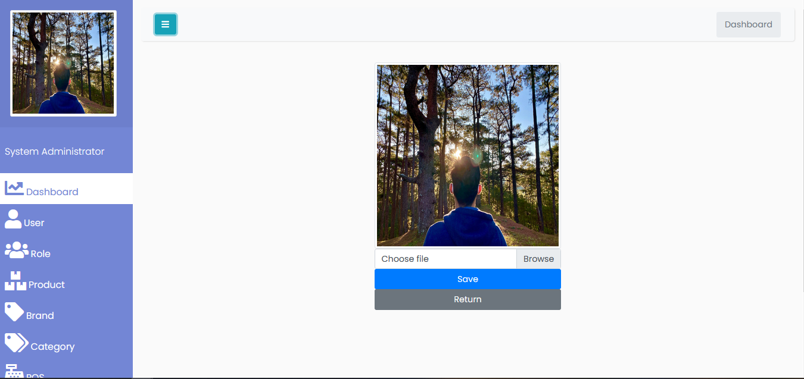
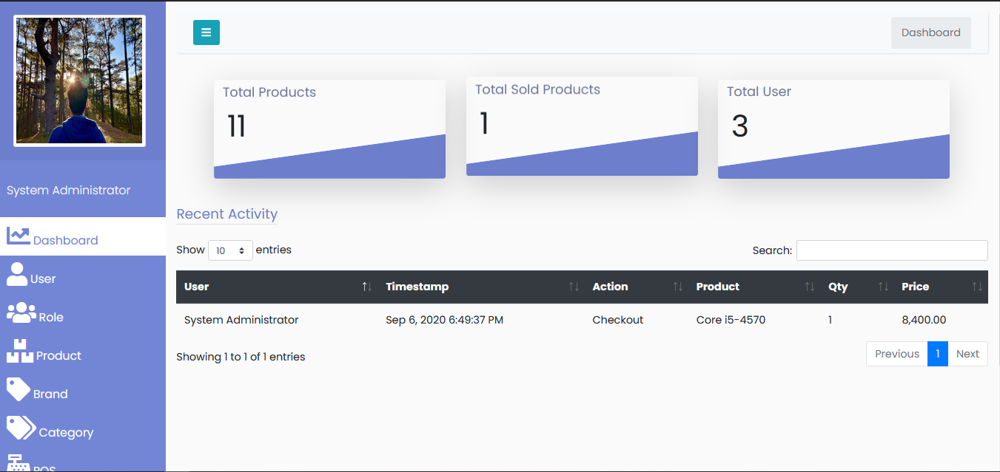
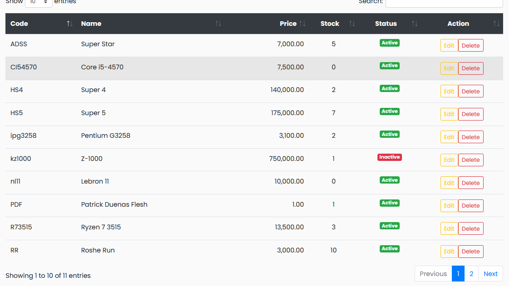
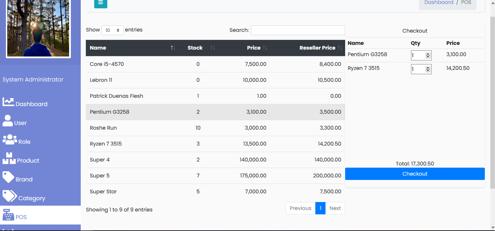
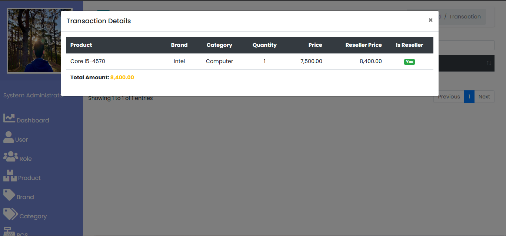

# Inventory 2019
Simple inventory system that features **dashboard**, **item inventory**, **POS**(Point of sales), **user authorization** and **transaction log**.
Using Java, JDBC API for back end. jQuery and BootStrap for user interface and experience.

## Objective
To learn BootStrap CSS Framework and implement through creation of projects.

## UI Sample

**User Profile**

**Dashboard**

**Item List**

**POS**

**Transaction**

